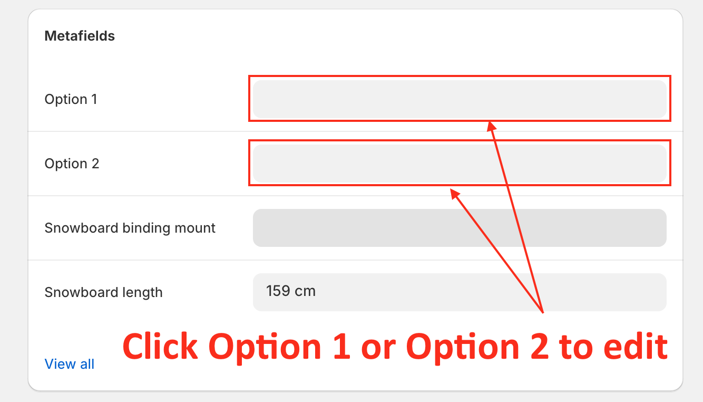
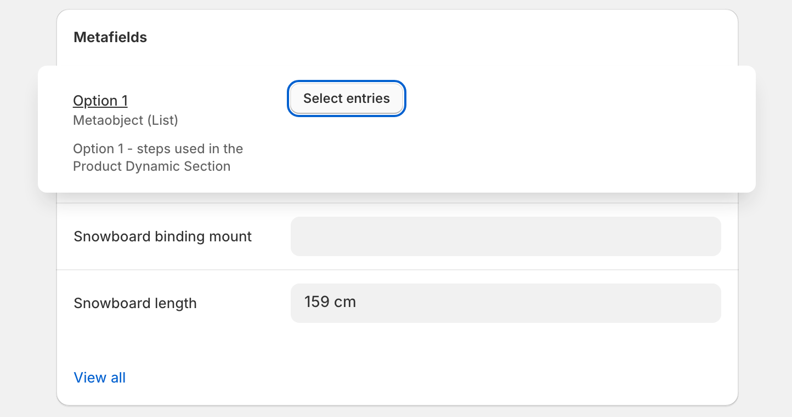
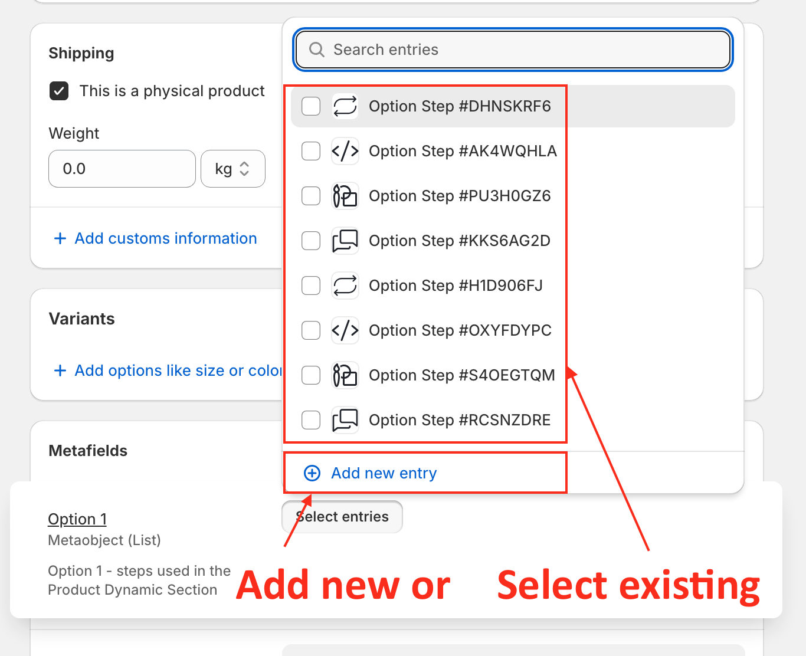
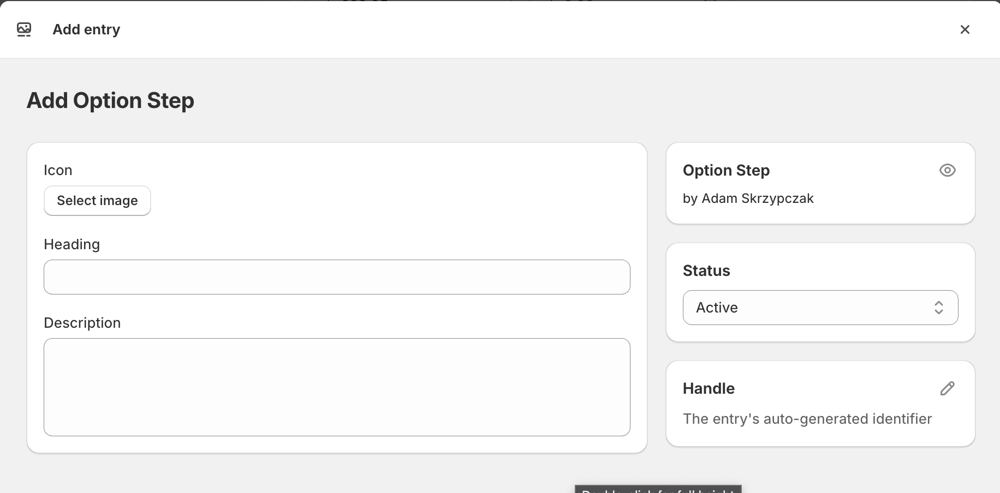
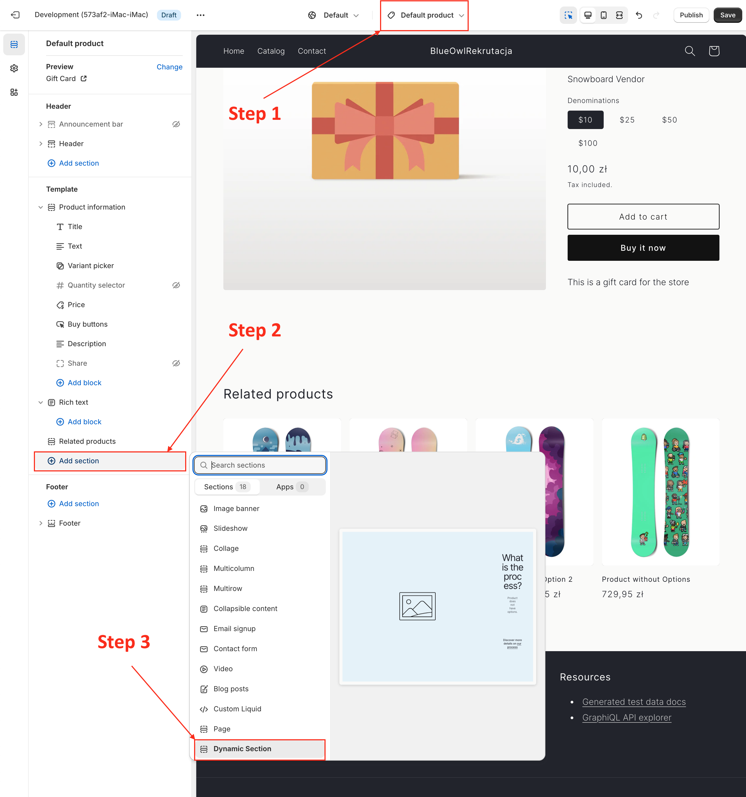
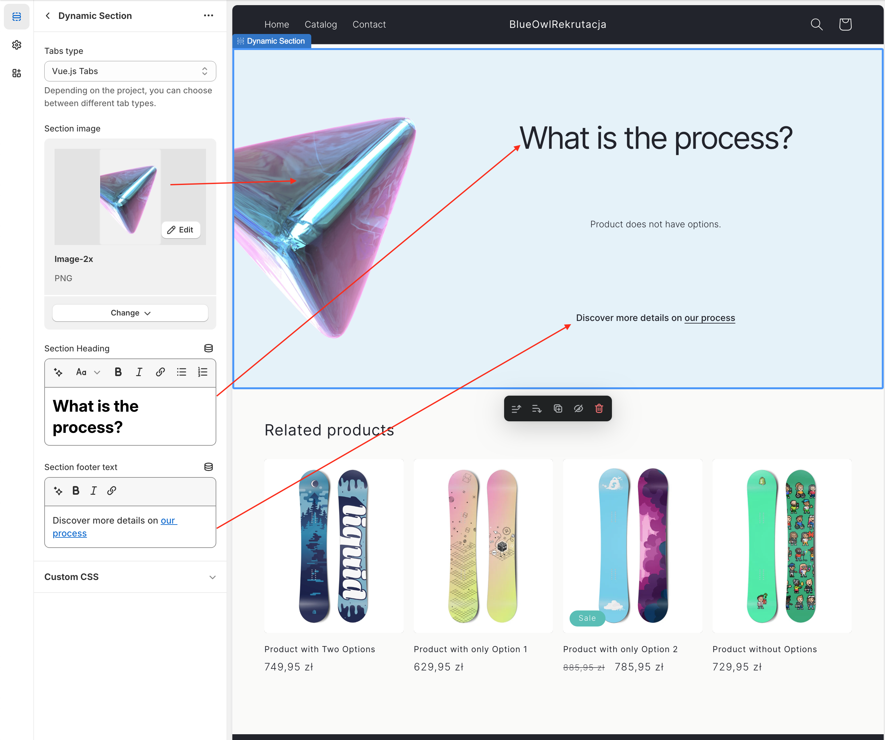

# Shopify Dynamic Section: `section-dynamic`

The `section-dynamic` is a versatile and dynamic Shopify section designed to create tabbed content areas `Options` and related `Steps`. This section is built using HTML, CSS and/or Javascript for seamless integration and easy customization.

Demo Store availabe here -> [blueowlrekrutacja.myshopify.com](https://blueowlrekrutacja.myshopify.com/).

## Features

- **Tabbed Navigation:** Users can switch between tabs (Option 1 and Option 2) to view related Steps.
- **Responsive Design:** The section is fully responsive and looks great on all devices.
- **Image Support:** Easily add and customize content within each tab based on Product Metaobject.

## Usage

### Adding and managing Product Metaobjects

Each product has assigned two metafields: `Option 1` and `Option 2`.
Each Option it is repetable metaobject (list type) allowing add multipe `Steps` to each `Option`.

#### Adding and managing metaobjects

1. In your Shopify admin panel, navigate to `Products`.
2. Select the Product to edit.
3. Scroll down to section `Metafiels`
4. Click `Option 1` or `Option 2` to edit.

5. Click `Select Entires`.

6. Select existing Entry/Entires or `Add new entry`.

7. Adding new entry allow add new `Step` with `Icon`, `Heading` and `Description`.

8. After editing `Save` the product

> **_NOTE:_**  Adding both options enable `Tabs`. If you set only one Option section will display static section (not tabbed). If you don't add any Options `Dynamic Section` will display information `Product does not have options.`

### Adding and Customizing Section

1. In your Shopify admin panel, navigate to `Online Store` > `Customize`.
2. Select the product page template.
3. Click on `Add section` and choose `Dynamic Section`.

4. Customize the tabs and content using the provided settings.

### Liquid Variables

When adding content, you can use the following Liquid variables:

- `Tabs Type`: Tabs type
- `Section image`: The image of the section.
- `Section Heading`: The heading of the section.
- `Section footer text`: The footer text of the section.

### Tabs Types

There are many ways to create tabbed content, and each has its own pros and cons. It all depends on the needs of the project. 

I create 3 types:

- `Vue.js Tabs`: Tabs functionality using Vue.js (v3) framework. 
- `Vanilla JS Tabs`: Tabs functionality using pure Javascript without any library.
- `Pure CSS Tabs`: Tabs functionality without using any scripts, just pure CSS.

